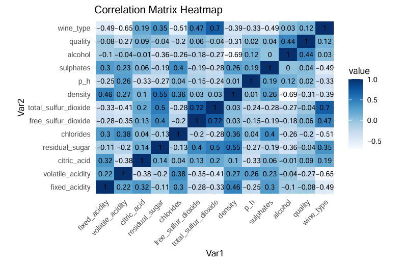
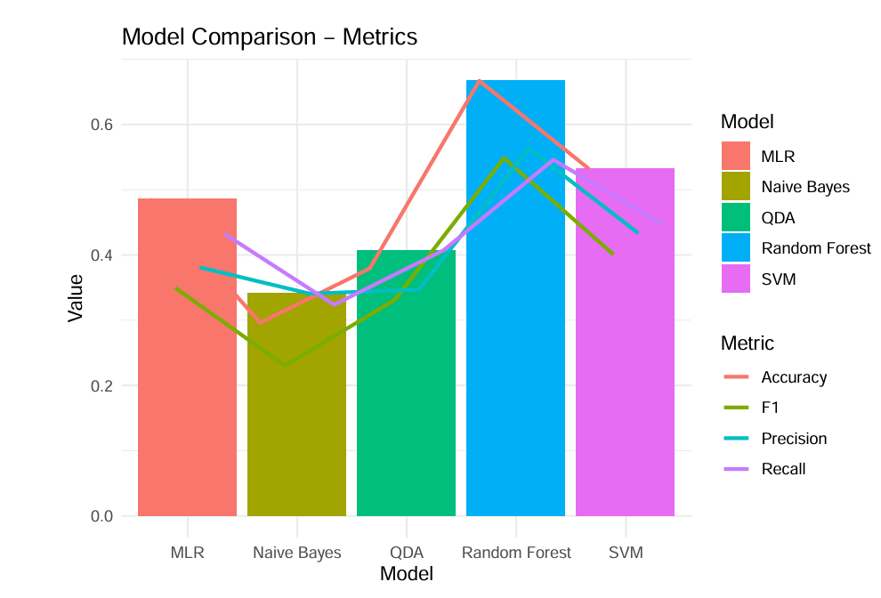

#  Wine Quality Prediction: 

## 📌 1. Giới thiệu (Overview)
Dự án này tập trung vào việc phân tích các đặc trưng hóa học và xây dựng mô hình máy học để dự đoán chất lượng rượu vang (thang điểm 3-9). Đây là một bài toán **Multi-class Classification** thực tế với dữ liệu bị mất cân bằng lớp nghiêm trọng, đòi hỏi các kỹ thuật xử lý dữ liệu và đánh giá thống kê chuyên sâu.

**Mục tiêu chính:**
*   Khám phá các yếu tố hóa học quyết định chất lượng rượu vang đỏ và trắng.
*   Xử lý dữ liệu mất cân bằng (Imbalanced Data) bằng kỹ thuật SMOTE.
*   So sánh hiệu suất giữa các mô hình máy học và đánh giá độ ổn định bằng phương pháp Bootstrap.

---

## 📊 2. Quy trình Phân tích Dữ liệu (EDA)

*   **Hợp nhất dữ liệu:** Kết hợp tập rượu đỏ (1599 dòng) và rượu trắng (4898 dòng), xử lý tên cột bằng hàm `clean_names` (snake_case) để tối ưu hóa việc code.
*   **Ma trận tương quan (Correlation Matrix):** 
    *   Xác định **Alcohol (0.44)** là biến có tương quan thuận mạnh nhất với chất lượng.
    *   **Volatile Acidity (-0.27)** và **Density (-0.31)** có tương quan nghịch rõ rệt.
*   **Phân tích đa biến (Pairplot & Violin Plot):** 
    *   Sử dụng `ggpairs` để xem xét mối quan hệ giữa các biến quan trọng nhất. 
    *   Sử dụng **Violin Plot** để nhận thấy sự khác biệt đặc trưng: Rượu đỏ có hàm lượng Axit bay hơi và Clorua cao hơn, trong khi rượu trắng có hàm lượng Đường dư và Lưu huỳnh đioxit cao hơn.

*Hình: Heatmap thể hiện mối tương quan giữa các đặc tính hóa học*

---

## 🛠 3. Kỹ thuật Đặc trưng (Feature Engineering)

Đây là giai đoạn then chốt giúp nâng cao độ chính xác của dự án:

1.  **Relabeling (Tái cấu trúc nhãn):** Do các lớp chất lượng cực thấp (3) và cực cao (9) có quá ít mẫu (dễ gây nhiễu), tôi đã gộp lớp 3 vào 4 và lớp 9 vào 8 để tạo ra các cụm dữ liệu có ý nghĩa thống kê hơn.
2.  **Xử lý Imbalanced Data bằng SMOTE:** 
    *   Sử dụng thư viện `scutr` để thực hiện thuật toán **Synthetic Minority Over-sampling Technique**.
    *   Tăng cường số lượng mẫu cho các lớp thiểu số (4, 7, 8) lên mức 1000 mẫu/lớp, giúp mô hình học được đặc trưng của các lớp này thay vì chỉ tập trung vào lớp đa số (5, 6).
3.  **Data Splitting:** Phân chia tập dữ liệu theo tỷ lệ 80/20 đảm bảo tính khách quan khi kiểm thử.

---

## 🤖 4. Huấn luyện Mô hình (Modeling)

Tôi đã thử nghiệm và so sánh 5 thuật toán máy học phổ biến:

*   **Logistic Regression (Multinomial):** Dùng làm baseline cho bài toán phân loại nhiều lớp.
*   **Quadratic Discriminant Analysis (QDA):** Thử nghiệm tính phi tuyến của dữ liệu.
*   **Naive Bayes:** Sử dụng kỹ thuật **Laplace Smoothing** để tránh xác suất bằng 0 cho các đặc trưng thiếu hụt.
*   **Random Forest (Mô hình tốt nhất):** Sử dụng kỹ thuật **Bagging** giúp giảm phương sai, xử lý tốt dữ liệu có độ nhiễu cao và cung cấp bảng xếp hạng tầm quan trọng của các biến (Feature Importance).
*   **SVM (Further Work):** Được triển khai để kiểm chứng khả năng phân tách trong không gian đa chiều.

---

## 📈 5. Kết quả & Đánh giá (Evaluation)

### So sánh hiệu suất:
Mô hình **Random Forest** đạt kết quả vượt trội trên mọi phương diện:

| Model | Accuracy | F1-Score | Precision | Recall |
| :--- | :--- | :--- | :--- | :--- |
| **Random Forest** | **0.6669** | **0.5486** | **0.5631** | **0.5458** |
| SVM | 0.5319 | 0.4005 | 0.4334 | 0.4469 |
| Multinomial Logistic | 0.4857 | 0.3496 | 0.3809 | 0.4322 |
| Naive Bayes | 0.2960 | 0.2304 | 0.3406 | 0.3236 |

### Đánh giá độ ổn định bằng Bootstrap:
Thay vì chỉ tin vào một lần kiểm thử, tôi áp dụng phương pháp **Bootstrap với R=100 lần lặp**. 
*   **Kết quả:** Độ chính xác dao động ổn định trong khoảng **[0.60 - 0.66]**. 
*   Điều này khẳng định mô hình có khả năng tổng quát hóa tốt và độ tin cậy cao trên các tập dữ liệu lạ.

---

## 💡 6. Kết luận & Insight 
*   **Insight:** Nồng độ cồn và Axit bay hơi là hai "từ khóa" quyết định chất lượng rượu vang. Việc kiểm soát nồng độ cồn ở mức vừa phải và giảm thiểu độ chua (axit bay hơi) sẽ trực tiếp cải thiện đánh giá chất lượng. Ngoài ra,
việc kiểm soát các yếu tố khác như độ pH, hàm lượng đường, độ đặc cũng rất quan
trọng.
*   **Kỹ thuật:** Kỹ thuật SMOTE và Random Forest là sự kết hợp hoàn hảo cho các bài toán dữ liệu bảng (Tabular Data) bị mất cân bằng trong thực tế.

---

