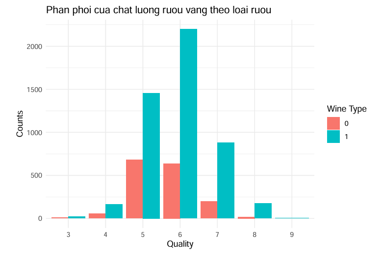

# [Project] Dự đoán Chất lượng Rượu Vang (Wine Quality Classification)

## 📌 Giới thiệu
Dự án này tập trung vào việc phân tích các đặc trưng hóa học và xây dựng mô hình máy học để dự đoán chất lượng của hai loại rượu vang (đỏ và trắng). Đây là một bài toán phân loại (Classification) với dữ liệu bị mất cân bằng lớp (Imbalanced Data).

**Mục tiêu:** Giúp các nhà sản xuất hiểu rõ các yếu tố ảnh hưởng đến chất lượng rượu và tối ưu hóa quy trình sản xuất.

---

## 🛠 Công cụ & Thư viện
*   **Ngôn ngữ:** R
*   **Thư viện chính:** `tidyverse`, `caret`, `randomForest`, `scutr`, `boot`.

---

## 📊 Quy trình thực hiện & Insight

### 1. Khám phá dữ liệu (EDA)
Dữ liệu cho thấy sự chênh lệch lớn giữa số lượng mẫu rượu trắng và rượu đỏ, đồng thời các lớp chất lượng tập trung chủ yếu ở mức 5 và 6.

*Hình 1: Phân phối chất lượng rượu vang theo loại (0: Đỏ, 1: Trắng)*

**Insight từ tương quan:** 
Thông qua ma trận tương quan (Heatmap), chúng ta xác định được các yếu tố then chốt ảnh hưởng đến chất lượng (Quality):
*   **Alcohol (0.44):** Tương quan thuận mạnh nhất. Rượu có nồng độ cồn phù hợp thường được đánh giá cao hơn.
*   **Volatile Acidity (-0.27):** Tương quan nghịch. Độ axit bay hơi cao làm rượu bị chua và giảm chất lượng.

*Hình 2: Ma trận tương quan giữa các đặc tính hóa học*

### 2. Kỹ thuật đặc trưng (Feature Engineering)
Do dữ liệu bị mất cân bằng nghiêm trọng ở các lớp chất lượng cực thấp (3, 4) và cực cao (8, 9), tôi đã thực hiện:
*   **Relabeling:** Gộp nhóm (3,4) thành lớp 4 và (8,9) thành lớp 8 để tăng mật độ thông tin.
*   **SMOTE (Synthetic Minority Over-sampling Technique):** Cân bằng lại các lớp để mô hình không bị bias vào các lớp đa số (5, 6).

### 3. Huấn luyện và Đánh giá mô hình
Tôi đã thử nghiệm 5 thuật toán khác nhau để tìm ra phương án tối ưu nhất.

*Hình 3: So sánh hiệu suất giữa các mô hình máy học*

**Kết quả:**
*   **Random Forest** vượt trội hoàn toàn về mọi chỉ số (Accuracy ~ 0.67, F1-Score ~ 0.55).
*   Các mô hình như Naive Bayes hay QDA cho kết quả khá thấp do giả định về phân phối dữ liệu không phù hợp với thực tế phức tạp của đặc tính hóa học rượu.

---

## 📈 Kết quả quan trọng

### Tầm quan trọng của đặc trưng (Feature Importance):
Qua mô hình Random Forest, hai yếu tố quyết định chất lượng rượu là:
1.  **Alcohol (Nồng độ cồn):** Yếu tố quan trọng nhất.
2.  **Volatile Acidity (Độ axit bay hơi):** Yếu tố quan trọng thứ hai.

### Đánh giá độ tin cậy:
Sử dụng phương pháp **Bootstrap (R=100)**, độ chính xác của mô hình Random Forest dao động ổn định trong khoảng **0.60 - 0.66**, chứng tỏ mô hình có tính ổn định cao khi áp dụng thực tế.

---

## 💡 Kết luận & Kiến nghị
*   **Kết luận:** Random Forest là mô hình tốt nhất để dự đoán chất lượng rượu vang trong tập dữ liệu này.
*   **Kiến nghị cho nhà sản xuất:** 
    *   Cần kiểm soát chặt chẽ **nồng độ cồn** và **độ axit bay hơi** vì đây là hai biến số ảnh hưởng trực tiếp đến chất lượng rượu. Ngoài ra,
việc kiểm soát các yếu tố khác như độ pH, hàm lượng đường, độ đặc cũng rất quan
trọng.
---

